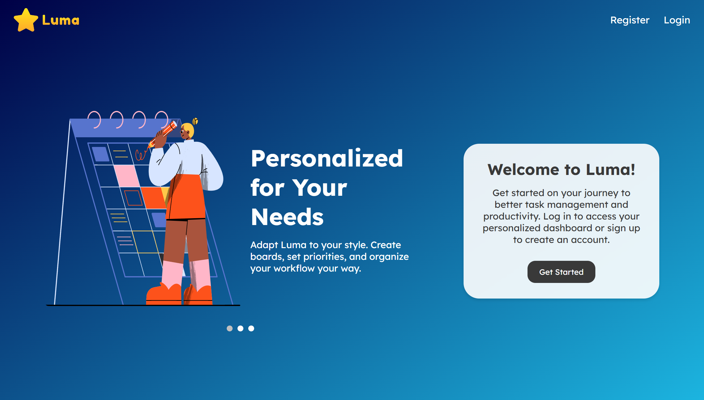
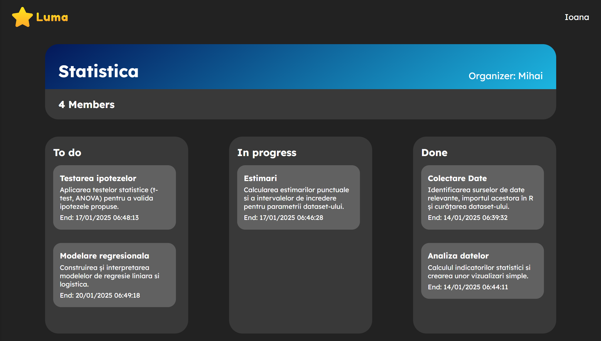
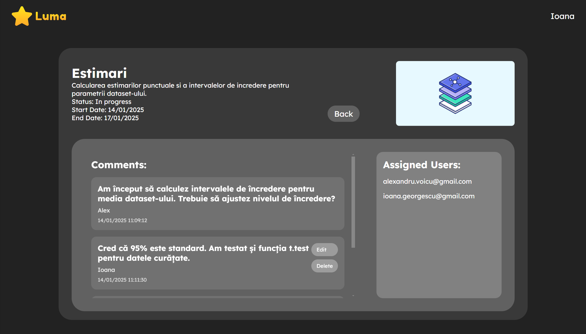

# **Luma - Task Management App**  

Luma is a **Trello-inspired** task management application designed to enhance project collaboration. Built with **C# (ASP.NET Core), Identity Framework, Entity Framework, MS SQL, and Razor Pages**, Luma provides an efficient way to organize tasks while following **Agile methodologies**.

## **🚀 Features**  

### **👥 User Roles**  
- **📌 Member** – A registered user with access to assigned projects and tasks.  
- **⚙️ Administrator** – Has full control over the platform, including user management and settings.  
- **📋 Organizer** – The creator of a project, responsible for managing team members, tasks, and assignments.  

### **📌 Project & Task Management**  
✅ Create and manage **multiple projects**  
✅ Add or remove **team members** from a project  
✅ Organize tasks into **customizable columns** (_To Do, In Progress, Done_)  
✅ **Drag & Drop** functionality for easy task management  
✅ Assign tasks to specific team members  
✅ Attach **images and videos** to tasks  
✅ **Comment system** for seamless team collaboration  

## **🛠 Technologies Used**  

- **Backend**: C# with ASP.NET Core  
- **Authentication & Authorization**: Identity Framework  
- **Database**: MS SQL + Entity Framework  
- **Frontend**: Razor Pages  

## **📸 Screenshots & Demo**  

### **🏠 Start Page**  
  

### **📂 Project Page**  
  

### **📋 Task Page**  
  
